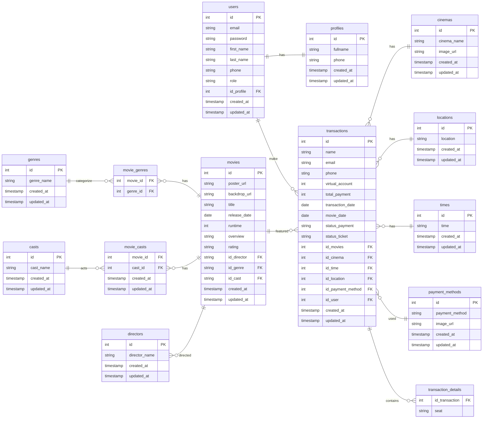

# Entity Relational Diagram Kukky

This WeeklyTask Project, presents an Entity-Relationship Diagram (ERD) for an Kukky Booking Ticket system using the Mermaid diagramming tool.

```mermaid
  erDiagram
  direction LR
  users ||--|| profiles : has
  movie_genres }o--|| movies : has
  genres ||--o{ movie_genres : categorize
  users ||--o{ transactions : make
  transactions }o--|| cinemas : has
  transactions }o--|| locations : has
  transactions }o--|| times : has
  transactions }o--|| payment_methods : used
  transactions ||--o{ transaction_details : contains
  movies ||--o{ transactions : featured
  movie_casts }o--||  movies  : has
  casts ||--o{ movie_casts : acts
  directors }o--|| movies : directed


  users {
    int id PK
    string email
    string password
    string first_name
    string last_name
    string phone
    string role
    int id_profile FK
    timestamp created_at
    timestamp updated_at
  }
  profiles {
    int id PK
    string fullname
    string phone
    timestamp created_at
    timestamp updated_at
  }

  movies {
    int id PK
    string poster_url
    string backdrop_url
    string title
    date release_date
    int runtime
    string overview
    string rating
    string id_director FK
    string id_genre FK
    string id_cast FK
    timestamp created_at
    timestamp updated_at
  }

  movie_casts {
    int movie_id FK
    int cast_id FK
    timestamp created_at
    timestamp updated_at
}
  casts {
    int id PK
    string cast_name
    timestamp created_at
    timestamp updated_at
  }
  directors {
    int id PK
    string director_name
    timestamp created_at
    timestamp updated_at
  }

  genres {
    int id PK
    string genre_name
    timestamp created_at
    timestamp updated_at
  }

  movie_genres {
    int movie_id FK
    int genre_id FK
  }

  transactions {
    int id PK
    string name
    string email
    sting phone
    int virtual_account
    int total_payment
    date transaction_date
    date movie_date
    string status_payment
    string status_ticket
    int id_movies FK
    int id_cinema FK
    int id_time FK
    int id_location FK
    int id_payment_method FK
    int id_user FK
    timestamp created_at
    timestamp updated_at
  }

  transaction_details {
    int id_transaction FK
    string seat
  }

  cinemas {
    int id PK
    string cinema_name
    string image_url
    timestamp created_at
    timestamp updated_at
  }

  locations {
    int id PK
    string location
    timestamp created_at
    timestamp updated_at
  }

  times {
    int id PK
    string time
    timestamp created_at
    timestamp updated_at
  }

  payment_methods {
    int id PK
    string payment_method
    string image_url
    timestamp created_at
    timestamp updated_at
  }

```
